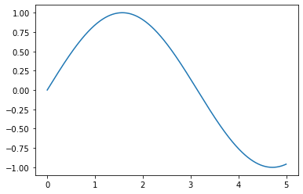

Start the  IDE:

```
nix-shell
code .
```

Then have a look at the output from a `curl` command.


```bash
%%bash
curl -v httpbin.org/get
```

    {
      "args": {}, 
      "headers": {
        "Accept": "*/*", 
        "Host": "httpbin.org", 
        "User-Agent": "curl/7.68.0", 
        "X-Amzn-Trace-Id": "Root=1-61fa462e-2dae841071a7bd19231dab3e"
      }, 
      "origin": "86.19.94.164", 
      "url": "http://httpbin.org/get"
    }


      % Total    % Received % Xferd  Average Speed   Time    Time     Time  Current
                                     Dload  Upload   Total   Spent    Left  Speed
      0     0    0     0    0     0      0      0 --:--:-- --:--:-- --:--:--     0*   Trying 35.171.190.227:80...
    * TCP_NODELAY set
    * Connected to httpbin.org (35.171.190.227) port 80 (#0)
    > GET /get HTTP/1.1
    > Host: httpbin.org
    > User-Agent: curl/7.68.0
    > Accept: */*
    > 
    * Mark bundle as not supporting multiuse
    < HTTP/1.1 200 OK
    < Date: Wed, 02 Feb 2022 08:51:58 GMT
    < Content-Type: application/json
    < Content-Length: 253
    < Connection: keep-alive
    < Server: gunicorn/19.9.0
    < Access-Control-Allow-Origin: *
    < Access-Control-Allow-Credentials: true
    < 
    { [253 bytes data]
    100   253  100   253    0     0    577      0 --:--:-- --:--:-- --:--:--   576
    * Connection #0 to host httpbin.org left intact


You can set environment variables in a code block:


```python
%env FOO bar
```

    env: FOO=bar


and it shows up in subprocesses launched from othe code cells:


```bash
%%bash
env | grep FOO || true
```

    FOO=bar


Here's a prolog for plotting pretty graphs:


```python
import matplotlib.pyplot as plt
import numpy as np
```

and here's a graph:


```python
print("setting up X")
x = np.linspace(0,5,1000)
print("step: constructing y-data")
y = np.sin(x)
print("step: display info about y")
plt.plot(x,y)
print("okay, I'm done now")
```

    setting up X
    step: constructing y-data
    step: display info about y
    okay, I'm done now


    

    


Github renders notebooks automatically in the browser, but not (for some reason) if it's a README. To convert this notebook to Markdown so Github can render it on the project page:


```python
!jupyter nbconvert --to markdown README.ipynb
```

    [NbConvertApp] Converting notebook README.ipynb to markdown
    [NbConvertApp] Support files will be in README_files/
    [NbConvertApp] Making directory README_files
    [NbConvertApp] Writing 2557 bytes to README.md

